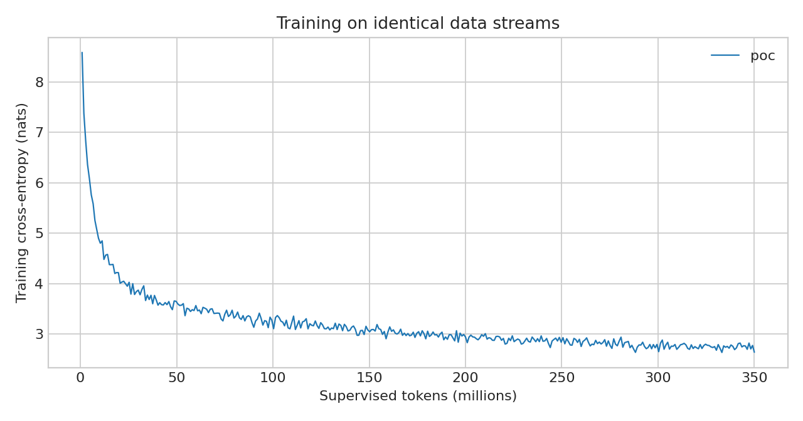
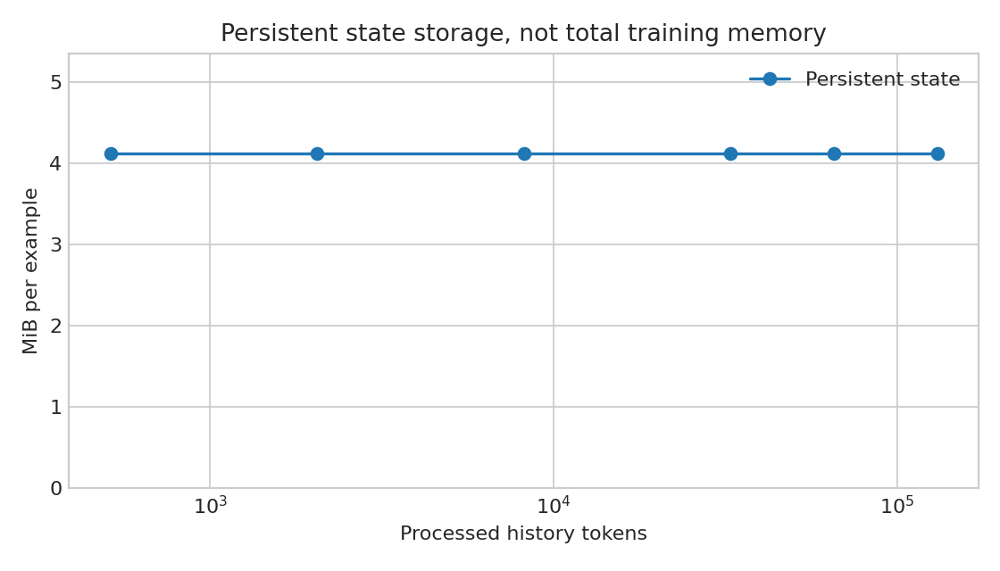

# Итоговый отчёт TfPLSLM

> Промежуточная версия: POC завершён; независимый SSM-контроль ещё обучается. Его результаты и окончательный статус аренды будут добавлены.

**Результат: частично работает.** Transformer-free модель с нуля устойчиво обучилась на 350 млн токенов; её recurrent state причинно переносит короткие факты через 512–2048 токенов, а размер рабочего состояния постоянен до проверенных 128k. Явная память полезна в части задач на 512, но общего преимущества на 2k нет, а на 8k/32k основной вариант не дал ни одного полностью правильного ответа. Сильная гипотеза о надёжной дальней семантической памяти этим прогоном не подтверждена.

## Реализация и архитектура

Основная модель: **77,087,008 параметров**. 16 блоков Mamba-2-style SSD, d_model=512, d_state=64, expand=2, head_dim=64, FFN=1536; связанная входная/выходная матрица эмбеддингов.
Triton SSD scan взят из [state-spaces/mamba](https://github.com/state-spaces/mamba/tree/95d8aba8a8c75aedcaa6143713b11e745e7cd0d9), commit `95d8aba8a8c75aedcaa6143713b11e745e7cd0d9`. Основной путь не содержит self-attention или KV-cache. Это собственная обвязка SSD + FFN, а не полная копия архитектуры Mamba-2.
Явная память — 16×256 float32. Она считывается до чанка и обновляется после 512 токенов. Два последовательных чанка имеют общий граф градиентов (1024 токена), после чего состояние отсоединяется; перенос состояния продолжается внутри документа. Граница документа сбрасывает всю строку состояния.
Каждый из 16 слоёв хранит SSD state 16×64×64 float32 и 3 предыдущих свёрточных входа. Дополнительно хранятся 4096 чисел явной памяти и сумма скрытых векторов незавершённого чанка. SSM-only содержит **72 609 024** параметра; Transformer — **75 883 520**, 16 слоёв, 8 attention heads, FFN=3072, окно 512 токенов.

## Данные и токенизатор

Источник: [Cultura-Ru-Edu](https://huggingface.co/datasets/deepvk/cultura_ru_edu), revision `55788b7e4a9b1f64c95e4bdd040b6ea93aa4e403`.

| Раздел | Документы | Подготовленные токены |
|---|---:|---:|
| train | 177,405 | 300,005,858 |
| synthetic | 62,412 | 50,000,122 |
| validation | 573 | 1,000,625 |

SentencePiece BPE, vocab=16 384, byte fallback, нормализация identity. Обучающая выборка tokenizer: 4,733 документов. SHA-256: `5c0a01637dd16a8e976f16e8249c9fe3076777262533087785bfaee1e2537b74`.
Train/validation имеют нулевое пересечение точных текстовых SHA-256; near-duplicate удаление не выполнялось. Документы обучения выбираются с возвращением: число просмотренных токенов не равно числу уникальных токенов.
Синтетика использует отдельный test seed, новые имена и изменённые формулировки. Overwrite/forget разделяют старый и новый факт 512 токенами. Дистанция benchmark — точный токенный промежуток от конца последнего факта до начала вопроса.
Обучающие дистанции синтетики: 64, 128, 256, 512, 1024 и 2048 токенов, с повышенной долей 512. Проверки 8192 и 32768 измеряют перенос за пределы обучающего распределения дистанций.

## Проверки и производительность

Tiny overfit в уменьшенной конфигурации `configs/smoke.json`: loss 5.564555 → 0.001257. Разница параметров после сохранения/восстановления следующего optimizer step: 0.0e+00.
Отдельный real-data pilot полной модели: 3,014,861 токенов, validation loss 9.8006 → 7.8993 (входная проверка на 8 batches, финальная на 32). До основного обучения прошли preflight генерации, memory evaluation и оценки размера состояния.
Пять основных unit tests прошли: причинность, эквивалентность полного чанка и пошагового инференса, градиенты записи памяти и сброс строк, Triton/reference forward+backward, document boundaries и sampler resume. Отдельный шестой тест проверяет причинность и backward Transformer. Основной прогон также был намеренно остановлен и успешно восстановлен на шаге 264 (12 428 934 токена), включая optimizer и 24 активные строки документов.
H100 PCIe 80 GB; PyTorch 2.6.0+cu124. Batch=64, chunk=512, unroll=2. После прогрева: **110,186 tokens/s**, 100 стабильных шагов, peak allocated **55.75 GiB**, GPU utilization 100%.
Benchmark использовал заранее размещённые случайные токены. Ниже приведена фактическая скорость с padding и документным загрузчиком.

## Обучение и language modelling

| Модель | Tokens seen | Natural / synthetic | Шаги | Время, с | Median useful tok/s | Validation loss | PPL |
|---|---:|---:|---:|---:|---:|---:|---:|
| poc | 350,025,631 | 300,145,627 / 49,880,004 | 7,461 | 4679.9 | 76,322 | 3.27198 | 26.36 |

AdamW (betas 0.9/0.95), LR 6e-4, cosine decay до 10%, warmup 100 шагов, clip 1.0, bf16 autocast. Оба SSM-прогона используют одинаковый sampler seed и токенный бюджет.
Transformer baseline подготовлен в коде и конфигурации; результаты его полного обучения здесь не заявляются.
Final validation использует 64 одинаковых документных batches с тем же seed у всех моделей. Промежуточные проверки использовали 8 batches; непосредственно final_training — 32. Сравнивать промежуточные и финальные PPL как один и тот же набор нельзя. Training loss включает синтетику и напрямую с natural-only validation loss не сопоставим.

| Модель | Peak train GiB | Median GPU % | Median loader wait / logged interval, с | Последний train loss |
|---|---:|---:|---:|---:|
| poc | 55.57 | 100 | 0.034 | 2.64137 |

Основная модель получила natural validation loss 3,27198 и PPL 26,36 на 399 150 целевых токенах. По сравнению с необученной моделью, выдававшей несвязные фрагменты слов, появилась русская грамматика и локально понятные фразы. Однако фиксированные samples ниже содержат повторы, противоречия, выдуманные даты и потерю темы. Поэтому критерий устойчивой связной генерации выполнен лишь частично. Это base LM, а не модель, обученная следовать инструкциям.

## Memory benchmark: normal state

| Distance | Semantic | Exact | Associative | Overwrite | Forget | Temporal | Multi-hop |
|---:|---:|---:|---:|---:|---:|---:|---:|
| 512 | 14/32 (43.8%) | 1/32 (3.1%) | 32/32 (100.0%) | 31/32 (96.9%) | 32/32 (100.0%) | 32/32 (100.0%) | 31/32 (96.9%) |
| 2048 | 5/32 (15.6%) | 0/32 (0.0%) | 19/32 (59.4%) | 32/32 (100.0%) | 30/32 (93.8%) | 7/32 (21.9%) | 32/32 (100.0%) |
| 8192 | 0/32 (0.0%) | 0/32 (0.0%) | 0/32 (0.0%) | 0/32 (0.0%) | 0/32 (0.0%) | 0/32 (0.0%) | 0/32 (0.0%) |
| 32768 | 0/32 (0.0%) | 0/32 (0.0%) | 0/32 (0.0%) | 0/32 (0.0%) | 0/32 (0.0%) | 0/32 (0.0%) | 0/32 (0.0%) |

Метрика — exact match сгенерированного ответа целиком (допускается конечная точка). Answer NLL — отдельная teacher-forced диагностика, она не заменяет accuracy. JSON содержит интервалы Wilson 95%, отдельные ответы и donor labels для shuffled state.

## Memory ablations: средняя accuracy по семи категориям

| Distance | Normal | Zero | Reset | Shuffle | No memory | SSM-only |
|---:|---:|---:|---:|---:|---:|---:|
| 512 | 77.23% | 1.34% | 75.45% | 3.57% | 58.93% | не измерено |
| 2048 | 55.80% | 0.89% | 5.36% | 5.36% | 58.04% | не измерено |
| 8192 | 0.00% | 3.12% | 4.46% | 0.00% | 4.46% | не измерено |
| 32768 | 0.00% | 0.89% | 3.57% | 0.00% | 5.80% | не измерено |

Категории имеют одинаковое число примеров, но разные пространства ответов; это описательное среднее, не общий chance-adjusted score.
Ориентир случайного угадывания правильной метки при известной категории: 12,5% для цвета, 16,7% для temporal, 1/900 для трёхзначных кодов и 1/16¹² для exact ID. Их равновзвешенное среднее — около 4,23%; это теоретический ориентир, а не измеренная генеративная baseline.
32 примера на категорию/дистанцию; не 32 независимых обучающих запуска. При 0/32 верхняя граница Wilson 95% около 10,7%, поэтому нулевое наблюдение не доказывает абсолютно нулевую способность.

При 512 токенах normal даёт 173/224 (77,23%), zero — 3/224 (1,34%), shuffle — 8/224 (3,57%), no_memory — 132/224 (58,93%). В парном сравнении включение явной памяти исправляет 43 ответа и портит 2. При 2048 normal — 125/224 (55,80%), zero — 2/224 (0,89%), no_memory — 130/224 (58,04%): 29 ответов исправлены и 34 испорчены. На этой дистанции сохраняются главным образом короткие числовые ассоциации, overwrite/forget и один простой multi-hop chain; цветовой semantic recall — 5/32, что не отделяется убедительно от случайного угадывания. На 8192 и 32768 normal — 0/224 в каждом случае, хотя отключение явной памяти оставляет небольшую точность на категориях с малым пространством ответов. Exact ID восстановлен полностью лишь в 1/32 случаев на 512 (870d5ffe0f64), далее — 0/32. Разные энтропии меток не позволяют считать прямое сравнение semantic и exact accuracy доказательством особого механизма семантического сжатия.

## Ablations на обычном русском тексте

| Модель | State | Loss | Δ к normal |
|---|---|---:|---:|
| poc | normal | 3.283033 | +0.000000 |
| poc | zero | 3.365060 | +0.082027 |
| poc | reset | 3.321327 | +0.038294 |
| poc | shuffle | 3.758471 | +0.475438 |
| poc | no_memory | 3.284415 | +0.001382 |

Zero обнуляет состояние перед каждым чанком; reset — перед каждой парой чанков; shuffle подставляет другую строку; no_memory отключает явную память, сохраняя SSD state. На synthetic benchmark интервенция делается перед одинаковым завершающим чанком; reset оставляет только последний полный чанк истории.
Ablation no_memory изменяет уже обученную модель, а SSM-only обучен независимо. Они отвечают на разные вопросы. Одинаковый seed не означает идентичную инициализацию общих весов из-за различного порядка создания модулей.

## Контрфактические проверки

| Модель | Подмена | Выход для красного / синего префикса | Mean abs logit Δ | KL |
|---|---|---|---:|---:|
| poc | normal | 120 / 120 | 0 | 0 |
| poc | swap_all | 120 / 120 | 0.398501 | 0.0029399 |
| poc | swap_memory | 120 / 120 | 0.0284848 | 9.26728e-06 |
| poc | swap_ssm | 120 / 120 | 0.400831 | 0.00277452 |
| poc | zero | 100-й год. В 1917 году / 100-й год. В 1917 году | 2.07741 | 1.9977 |

На natural validation обнуление всего состояния увеличивает loss на 0,0820 nat/token, shuffle — на 0,4754; отключение только explicit memory — на 0,00138. Следовательно, полезность общего recurrent state показана, а его LM-эффект в основном не требует явного модуля. Более сильная содержательная проверка — ответы донора при shuffle: на 512 associative и forget переходят к метке донора в 32/32 случаях, overwrite и multi-hop — в 31/32; на 2k overwrite — 32/32. Это причинный перенос конкретного короткого факта через состояние. Отдельная перефразированная пара «красная/синяя машина» провалена: обе нормальные генерации — «120», подмена памяти правильный цвет не восстановила. Малое ненулевое изменение logits при swap_memory означает вычислительное влияние, но не правильное семантическое извлечение.

| Дистанция | Категория | Accuracy исходного ответа при shuffle | Accuracy ответа донора |
|---:|---|---:|---:|
| 512 | semantic | 9.38% | 40.62% |
| 512 | exact | 0.00% | 0.00% |
| 512 | associative | 0.00% | 100.00% |
| 512 | overwrite | 0.00% | 96.88% |
| 512 | forget | 0.00% | 100.00% |
| 512 | temporal | 15.62% | 96.88% |
| 512 | multihop | 0.00% | 96.88% |
| 2048 | semantic | 15.62% | 15.62% |
| 2048 | exact | 0.00% | 0.00% |
| 2048 | associative | 0.00% | 59.38% |
| 2048 | overwrite | 0.00% | 100.00% |
| 2048 | forget | 0.00% | 93.75% |
| 2048 | temporal | 21.88% | 21.88% |
| 2048 | multihop | 0.00% | 96.88% |

Donor accuracy — совпадение с меткой того примера, чьё состояние было подставлено. В этих задачах оно информативнее простого изменения logits. Совпадения меток между разными примерами возможны, поэтому для малых пространств ответов их нужно сопоставлять с normal/zero.

## Диагностика состояния

| Модель | Последний SSD RMS | Max abs за прогон | Последний memory RMS | Retain mean | Write mean | Dead slot fraction |
|---|---:|---:|---:|---:|---:|---:|
| poc | 0.0686874 | 265.207 | 0.0212489 | 0.958969 | 0.0988051 | 0.427 |

Для SSM-only нули в столбцах явной памяти означают отсутствие модуля. Метрики gates — среднее по последнему логированному batch, dead определяется RMS < 1e-5. Это не мера полезности слотов; причинные ablations важнее амплитуды состояния. Полные gate saturation и slot RMS сохранены в metrics.jsonl.
Отдельная диагностика на natural validation исключает padding и переходы через границы документов: 86,97% изменений слотов имеют RMS < 1e-5; медиана retain=0,99950 и write=0,00240. Один слот существенно активнее остальных. На обычном тексте writer почти закрыт; это согласуется с малым LM-эффектом no_memory, но не означает, что память не работает на синтетике. Средняя абсолютная корреляция координат слотов 0,016 — это диагностическая статистика, не доказательство независимости представлений.

## Рабочая память

| История | State bytes | Allocated bytes | Peak allocated bytes |
|---:|---:|---:|---:|
| 512 | 4,323,328 | 352,219,648 | 519,633,408 |
| 2,048 | 4,323,328 | 352,219,648 | 524,026,368 |
| 8,192 | 4,323,328 | 352,219,648 | 524,026,368 |
| 32,768 | 4,323,328 | 352,219,648 | 524,026,368 |
| 65,536 | 4,323,328 | 352,219,648 | 524,026,368 |
| 131,072 | 4,323,328 | 352,219,648 | 524,026,368 |

Это фиксированный размер recurrent working state при фиксированном batch/chunk, а не утверждение O(1) о всей системе или обучении.

## Примеры генерации

**Prompt:** Однажды вечером в маленьком городе

Сент-Дартс (Сент-Экзюпери) на улице Сент-Экзюпери (Сент-Экзюпери) произошло ожесточенное сражение между Германией и Францией. В начале 1940-х годов англичане избрали США, Великобритании и Канады.
В 1950 году британцы во главе с Генрихом Райсом, который отказался от «возмездного и недобросовестного» труда, и вернулся к своей книге «Уроки французского языка». После революции 1959-го он был арестован в Варшаве, с января 1950-го по 1957 год

**Prompt:** Почему небо кажется синим?

- Ветеринар - Сайт про сон
Ученые выяснили, почему Солнце не ест. Причины возникновения засухи
10.01.2012 01:28:59
На самом деле, по данным статистики, на 83% приходится 111,1%, а это на 6,5%.
По данным Министерства энергетики РФ за 2012 год этот показатель составил 66,4%. В то же время, за 33 года за 64 месяца 1978 год, за 115 лет, было зарегистрировано 14111 человек (в том числе в 2011 году), а на 57,8

**Prompt:** Научный эксперимент показал, что

за время пребывания в космосе, в космосе, многие люди не просто погибли от коронавируса, но и потеряли связь с коронавирусом. И если бы они перенесли этот эксперимент, мы бы не дали никаких результатов, если бы не это, то сегодня мы попробуем ответить на этот вопрос.
«Представьте, что вы набрали за это время на 1000 кг, а потом потеряли 4370 кг. Это и есть основной удар этого процесса», — пояснил Динс.
Так как «загрязнение воздуха является одним из самых смертоносных (по сравнению с смертью) и смертей в космосе, то для человека, зараженного вирусом, это нормальная реакция, которую мы называем

**Prompt:** История России тесно связана с

историей России. Войны с Турцией были особенно заметными в истории России. Но с 12 века русские, по-настоящему любимые русские и итальянские русские, считали себя союзниками. Именно они и привели к победе русской армии. За всю историю русской литературы русская литература, по-видимому, была в 1228 г. одним из наиболее известных русских русских писателей.
Фото: Е.А. Васаева, 1846
В 1235 г. польский император Николай II в 1226 г. принял решение о перенесении русских войск на Москву со стороны СССР. Он решил, что русская сила, на которую он возродился, в 122

**Prompt:** Анна открыла дверь и увидела

, как с одной стороны в ней работает «свежий свет». Этот факт говорит о том, что она не только помогает нам, но и помогает нам не только, но и другим людям.
«В этом мире, — писала она, — она не только не может нам помочь, но и поможет, и помогает ей. В этой книге много новых книг, которые можно найти, но все они просты, разнообразны и по-разному отображаются. Они, конечно, помогают, но их можно найти среди многочисленных.
По словам одного из авторов, у каждого человека есть свои секреты, которые им необходимо знать.
Он отметил, что люди, обладающие такими навыками мысли и чувства, знают о своих мыслях, поэтому они никогда не смогут увидеть их.
Всего

## Ограничения и научная интерпретация

Один seed на вариант; малый токенный бюджет для модели 77M; ограниченная выборка benchmark; фиксированные шаблоны и filler; градиентный горизонт 1024 токена; явная память обновляется усреднённым представлением чанка. По одному такому прогону нельзя делать вывод о превосходстве над Transformer или об общей непригодности bounded memory.
Синтетика состоит из семи простых семейств и восьми повторяемых filler-предложений. Отдельные слова ответов temporal могут случайно встретиться в filler независимо от правильной метки. Длина и шаблоны отличаются от естественных длинных документов; это ограниченный диагностический benchmark.
Multi-hop содержит одну цепочку без конкурирующих связей; успех можно получить, удержав её конечный номер, без общего композиционного рассуждения. Overwrite/forget проверяют актуальное значение в простой последовательности, а не произвольное адресное удаление множества фактов. Одновременная ёмкость для большого набора независимых фактов не измерена.

Не сработали надёжный перенос на 8k/32k, устойчивый exact recall случайного 12-символьного ID, свободно перефразированный цветовой контрфактический тест и связное продолжение произвольной темы. Не наблюдалось NaN или exploding state; это отрицательный результат качества, а не авария обучения. Возможные причины — слабый вес ответа в общем next-token objective, усреднение чанка при записи, короткий градиентный горизонт и отсутствие дистанций >2048 в тренировочной синтетике. Их причинный вклад здесь не разделён. Замкнутые gates на natural validation не позволяют объявить полный collapse: на синтетике explicit memory явно улучшает часть коротких задач.

В подготовленной синтетике ответы вместе с EOS занимают **346 452 из 49 937 710** supervised токенов (0,694%). При смеси 1/7 это около **0,099% позиций, по которым усредняется общий LM loss**. Поэтому снижение общего loss само по себе почти ничего не говорит об обучении recall. Это измеренная доля токенов, не доказательство причины провала. Метод подсчёта сохранён в `scripts/analyze_synthetic_supervision.py`.

## Артефакты и воспроизводимость

`artifacts/<model>`: config, metrics, полный last.pt, eval. `data`: tokenizer, uint16 shards, индексы границ, manifest и хэши. `artifacts/environment`: версии библиотек, аппаратное окружение и ставка аренды. Полный checkpoint содержит optimizer, RNG, scheduler position, sampler cursors и recurrent state. Код и небольшие результаты опубликованы в GitHub; большие checkpoints и данные сохранены локально, вне Git.

## Стоимость

Зафиксированная ставка аренды: $3.176253/час. Итоговая оценка и статус остановки фиксируются отдельно после копирования результатов. Это расчёт по времени, не выписка Vast.ai.

## Вывод и следующий эксперимент

Архитектура жизнеспособна как быстрый recurrent русский LM с ограниченным working state. Полезная передача информации между чанками доказана для простых коротких фактов; broad semantic long-range memory и преимущество явной памяти на больших дистанциях — нет. Само по себе постоянство размера состояния не гарантирует сохранности его содержимого. Увеличивать размер модели или добавлять variational/hierarchical/external memory по результатам этого опыта преждевременно; сначала нужен контролируемый тест обучающего сигнала.

**Ровно следующий эксперимент:** короткое A/B-дообучение из одного и того же сохранённого POC-checkpoint, где единственное различие — вес loss на токенах синтетического ответа: 1 против 50. Архитектуру, данные, порядок примеров, число токенов, chunk и unroll оставить одинаковыми. Затем повторить те же held-out normal/zero/shuffle/no_memory проверки на 512, 2k, 8k и 32k и natural validation. Это проверит гипотезу о слишком слабом сигнале recall до изменения ёмкости или механизма памяти. Этот следующий эксперимент в текущую аренду не запускался.